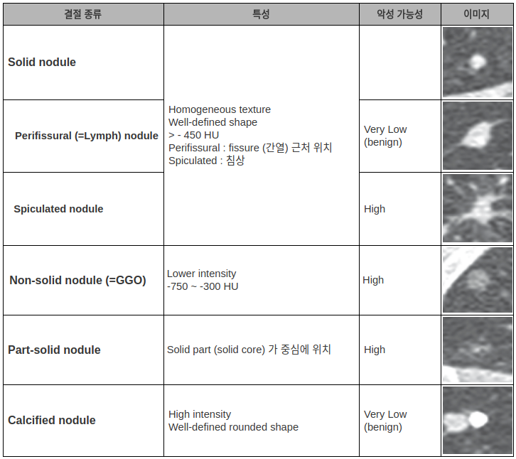
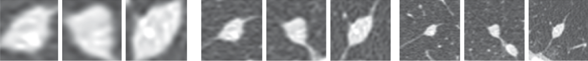
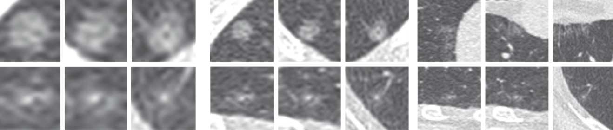
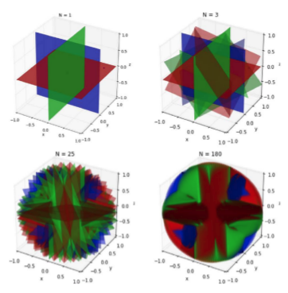
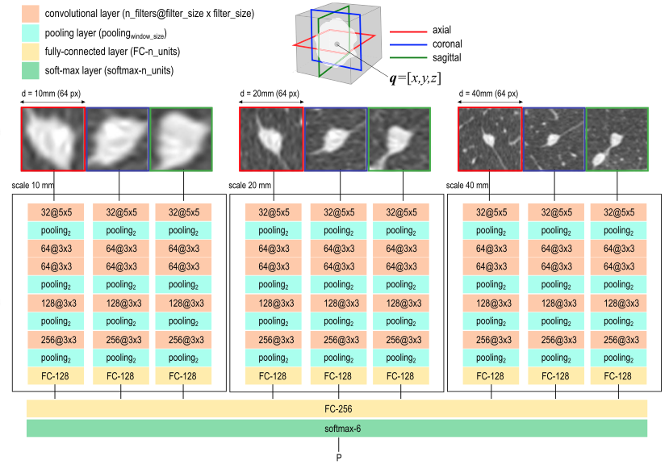
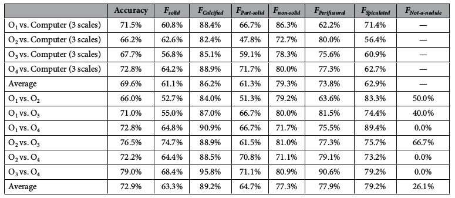
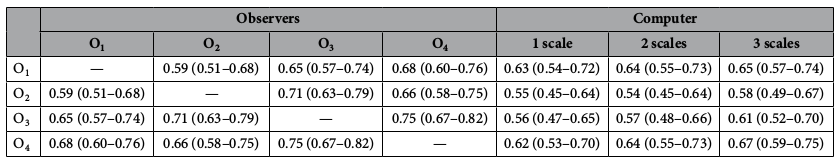
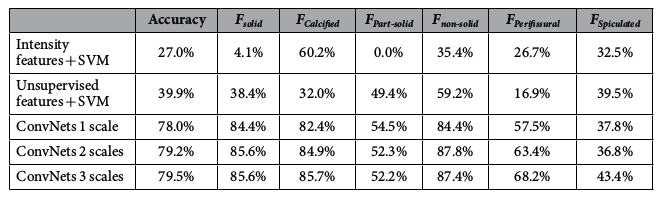
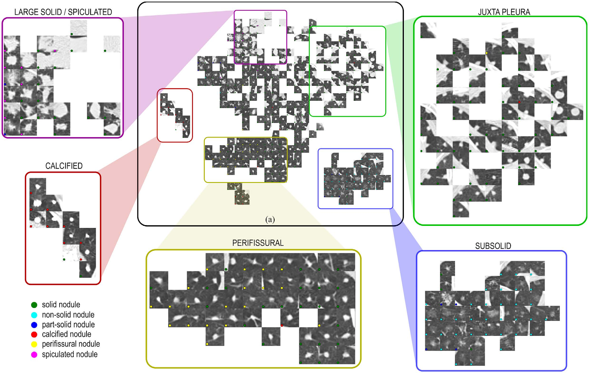
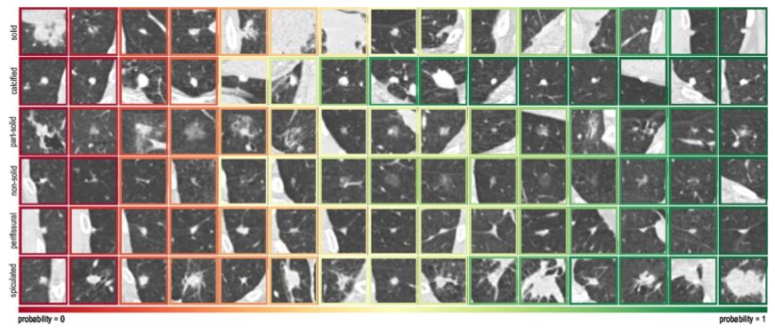

#### TLDR
기존의 feature를 뽑아서 classic ML 방식으로 폐 결절(nodule)의 class를 분류했던 문제를 딥러닝의 convolution network를 사용한 새로운 구조(multi-stream multi-scale)를 single system으로 분류하는 방법을 처음으로 제시했습니다. 이 때, 성능이 classic ML보다 나으며 사람 평가 성능의 신뢰도 내에 있음을 보입니다. 

***
### 폐 결절(nodule) 분류 
폐 결절은 아래 표와 같이 크게 3가지, 세분화되어 5가지 class로 분류 할 수 있습니다. 결절의 분류가 중요한 이유는 악성 가능성을 알 수 있기 때문입니다. 결절의 종류만 정확하게 분류하면 환자가 어떤 상태인지 알 수 있는 것이죠. 하지만, 오른쪽 이미지를 보시다시피 쉽게 구분이 가능한 결절이 있는 반면 아주 헷갈리는 결절도 있습니다. 이는 진단을 하는 의사마다 다른 결과를 나오게 만들기 때문에 새로운 평가 기준이 필요합니다. 
<figure>
	
	<figcaption>그림1. 폐 결절 분류</figcaption>
</figure>	

### Inter-observer variability
앞서, 이미지의 모호함으로 인해서 결절의 분류 작업이 쉽지 않다는 것을 살펴봤습니다. 의사마다 판단의 결과가 다르다고 하면 두 결과를 함께 고려해서 어느 정도의 정확도를 가지는 지를 평가해야 합니다. 그래서 서로 다른 평가자의 동의 정도를 나타내는 통계량인 Cohen k statistics를 도입해서 의사 vs 의사, 의사 vs 컴퓨터 간의 성능을 측정합니다. 

- Cohen k statistics: $$\kappa \equiv \dfrac {p_o - p_e} {1 - p_e} = 1 - \dfrac {1 - p_o} {1 - p_e}$$

### Multi-stream multi-scale 구조
CNN 기반의 구조는 결절을 검출 할 때 중요한 내용들을 기반으로 설계합니다. 먼저, scale 관련해서는 아래 2가지 그림을 보시면 왜 여러 가지 크기의 nodule을 함께 고려하는게 중요한 지 알 수 있습니다. 

- Scale 
	- Perifissural은 결절 주위에 [림프선?] 의 확인이 매우 중요합니다. 1번째, 2~3번째 그룹을 비교하면 축소해서 본 경우에 더 선의 확인이 잘 됩니다. 
	<figure>
		
  		<figcaption>그림2. perifissural 결절 이미지 (크기 순서대로 x4, x2, x1) </figcaption>
	</figure>	
	- non-solid와 part-solid의 경우 solid core의 유무로 구분을 해야 하는데 멀리서 봤을 때는 이게 구분이 어렵습니다. 대신 좀 더 확대해서 보면 구분이 잘 되죠. 
	<figure>
		
  		<figcaption>그림3. non-solid 결절(1행), part-solid 결절(2행) </figcaption>
	</figure>	
- Stream
	- CT를 찍으면 3-D로 구성된 이미지 정보를 얻을 수 있습니다. Multi-stream은 이 정보들을 최대한 다양하게 활용하자는 접근 방법입니다. Augmentation의 일종으로 볼 수 있습니다. axial, coronal, sagittal 3개의 평면 축을 기준으로 일정 각도만큼 돌렸을 때 결절 간의 만나는 단면을 데이터로 활용하는 것입니다. [근거] 
	<figure>
		
  		<figcaption>그림4. N에 따른 augmentation 시각화</figcaption>
	</figure>	

### Methods
- 데이터
	- Multi-Scale: 결절의 영역을 크기 별로 (d = 10, 20, 40mm) 잘라내서 resize 해줍니다. 
	- Multi-Stream: 3개 평면에 각도 변화를 줬을 때 스캔과 만나는 단면을 데이터로 사용합니다.  
	- Prediction: 데이터가 theta에 dependent하기 때문에 예측할 때 사용하는 데이터에도 theta를 고려해줍니다. [내용 정확히 확인]                       
- 모델 구조
	- 특별한 내용은 없고 N*d[N*d? d?] 개 만큼의 2-D patch를 convolution VGG 기반 모델에 집어넣고 나온 feature들을 합쳐서 예측을 한다. 같은 scale(d)에 대한 network 간에는 parameter를 공유한다.
	<figure>
		
  		<figcaption>그림5. 모델 구조</figcaption>
	</figure>	

### Observer study
Cohen k statistics를 평가 기준으로 의사, 컴퓨터 간의 Inter-observer variation를 구합니다. 이 때, 의사는 3명($O_1, O_2, O_3$) 으로 구성되며 모두가 20년 이상의 경력을 가진 radiology researcher입니다. 그리고 $O_4$는 데이터셋에(DLCST) 주어진 annotation으로 설정합니다. 그리고 3 scale을 모두 고려한 모델과 비교한 결과는 아래와 같습니다. 
눈으로 쉽게 구분되는 calcified의 경우 의사나 컴퓨터 모두 성능이 가장 높게 측정되었고 나머지 class는 [근거]
<figure>
	
	<figcaption>표1.</figcaption>
</figure>	
<figure>
	
	<figcaption>표2. 의사-의사, 의사-컴퓨터 간 inter-observer variation 결과 </figcaption>
</figure>	

### Discussion
- 타 ML 알고리즘과 비교: 모든 class에 대해서 잘 예측합니다. 성능을 전체적으로 봤을 때 spiculated가 떨어지는데 데이터가 적은 영향이 크다고 합니다.
<figure>
	
	<figcaption>표3. SVM - ConvNet 성능 비교</figcaption>
</figure>	

- t-SNE 분석: t-SNE는 feature 간의 유사도를 시각화 할 때 사용하는 방법입니다. 모델의 최종 feature를 시각화했을 때 아래와 같은 이미지의 군집을 얻을 수 있습니다. 보시면, large solid 와 spiculated이 같은 군집 내에 위치한 것을 볼 수 있고 모델이 둘 간의 구분을 어려워 할 것을 예상 할 수 있습니다. [실제 성능]
<figure>
	
	<figcaption>그림6. 결절 class 별 t-SNE 분포</figcaption>
</figure>	
- 예측 결과 분석: 예측된 결절의 형태가 전형적인지, 비전형적인지에 따라 예측 확률을 살펴봅니다. 사람이 라벨링을 한 데이터를 학습시켰기 때문에 전형적인(많은) 데이터에 대해서는 높은 확률로 예측을 잘 하고, 비전형적인(상대적으로 적은) 데이터에 대해서는 낮은 확률로 예측을 하는 것을 확인 할 수 있습니다. 
<figure>
	
	<figcaption>그림7. 결절의 형태에 따른 예측 결과</figcaption>
</figure>	

### Reference
[1] [Lung-RADS assessment categories](https://www.acr.org/-/media/ACR/Files/RADS/Lung-RADS/LungRADS_AssessmentCategories.pdf?la=en)  
[2] [2017 Guideline for Pulmonary nodules](http://www.radiologyassistant.nl/en/p5905aff4788ef/fleischner-2017-guideline-for-pulmonary-nodules.html)  
[3] Ciompi, F. et al. Towards automatic pulmonary nodule management in lung cancer screening with deep learning. Nature Reviews Cancer.  
[4] [강은영. 저선량 흉부 컴퓨터단층촬영을 이용한 폐암 선별검사: 영상의학 측면의 최신지견. 대한의사협회지.](2015. https://synapse.koreamed.org/pdf/10.5124/jkma.2015.58.6.523)  

### 단어
- [spiculation](http://www.ejm.org/upload/42844891.pdf): 바늘 모양
- pulmonary: 폐의
- [Ground-glass opacity](https://en.wikipedia.org/wiki/Ground-glass_opacity): GGO CT scan에서 비특이적인 결과이며, 삼출액 또는 누출에 의한 폐 공기 공간의 부분 채우기뿐만 아니라 폐포 폐의 부분적 붕괴 또는 부분 붕괴를 나타냅니다.
- Fissure : 간열, 균열 부분 
